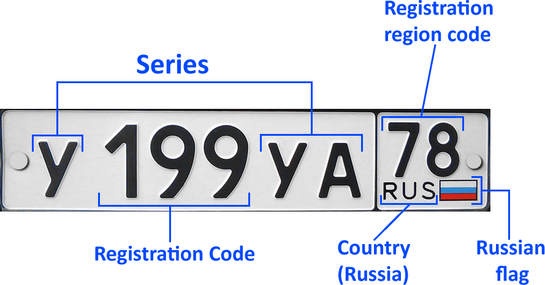
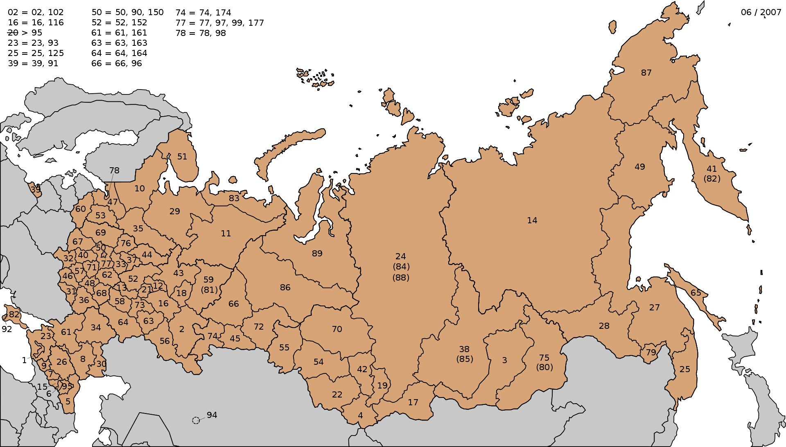
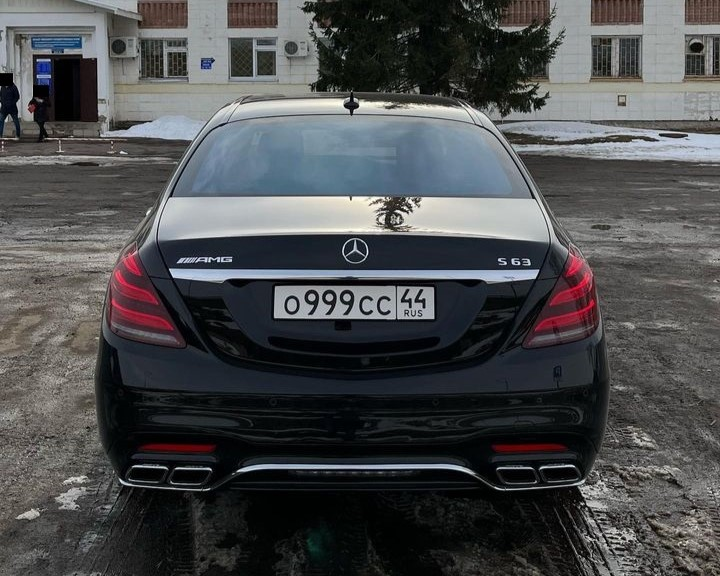
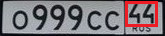
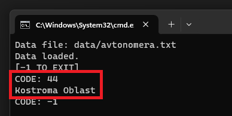

# Avtonomera 🚨
> All data was taken from [Wikipedia](https://en.wikipedia.org/wiki/Vehicle_registration_plates_of_Russia).

This program identifies the region of a **Russian license plate** by it's **registration region code**.

## How does it work
The program performs a *dichotomous search* (fastest searching algorithm) through Wikipedia's data, which has been adapted for it by myself. Once the registration region code is found, shows the region associated with it.

## Usage Example
Let's try the program on a real car, like for example this beautiful **Mercedes-Benz S63 AMG**.

> Picture by [@avtonomer44rus](https://www.instagram.com/avtonomer44rus/)

The first step is to identify the **registration region code**. We can see it pretty clearly with the example we saw earlier.

As we can see, the registration region code is `44`. Let's try it on the program now.

After entering the file name of the Wikipedia data (stored @ `./data/avtonomera.txt`), the program found the region of the code we were looking for.

The code `44` ended to be from **Kostroma** (Кострома).

> *Thanks for reading)*